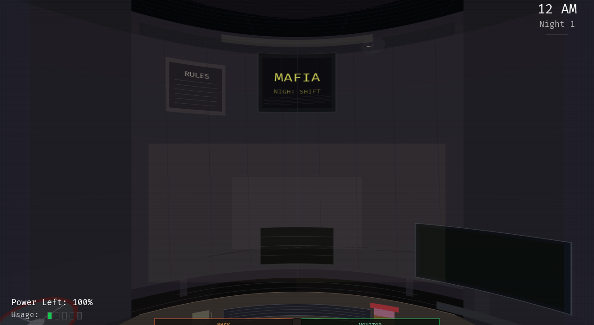
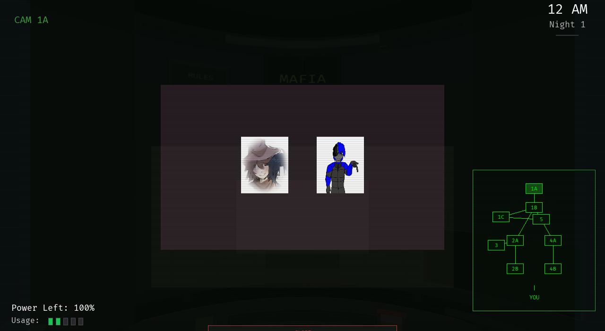

# Neko

[](https://github.com/Renan2010p/neko/actions/workflows/ci.yml)
[](LICENSE)
[](https://ziglang.org)

A small, general-purpose **2D game engine for Zig**, with pluggable backends.

Neko gives your game one platform-agnostic API — `neko.draw`, `neko.text`,
`neko.sprite`, `neko.sound`, `neko.input`, … — and hides the platform behind a
backend. The same core runs on the desktop (**SDL2** / **SDL3**) and on
freestanding targets (**PlayStation 2**, **PlayStation 1**, **headless**).

## Contents

- [Features](#features)
- [Made with Neko](#made-with-neko)
- [Requirements](#requirements)
- [A whole game](#a-whole-game)
- [Using it from a game](#using-it-from-a-game)
- [pygame compatibility](#pygame-compatibility)
- [Backends are plugins](#backends-are-plugins)
- [Working on the engine](#working-on-the-engine)
- [Layout](#layout)
- [License](#license)

## Features

- **Easy to start** — a `Game` struct plus `neko.app.run` is a whole game.
- **2D-friendly** — input actions (`neko.input.Actions`), an asset registry with
  visible errors (`neko.assets`), a camera (`neko.Camera2D`) and animation clips
  (`neko.scene.Animator`).
- **Modular** — `src/core/**` never touches the OS; backends do the heavy lifting.
- **Pluggable** — a backend is a plugin registered in
  `src/backend/registry.zig`; adding one never touches `build.zig` or the core.
- **Documented** — a guide in [`docs/`](docs/README.md).
- **Portable** — hosted and freestanding targets share the same core.

## Made with Neko

**Five Nights With Friends — Classic Edition** — a native Zig game built on Neko
([`fnwf`](https://github.com/Renan2010p/fnwf)):

| Office | Security monitor |
|--------|------------------|
|  |  |

More, including the pygame games **RENGEAR** and **VESPER** running through the
Python bindings, in [`docs/screenshots/`](docs/screenshots).

## Requirements

- **Zig 0.17.0**
- **SDL2** or **SDL3**, each with `_ttf` / `_image` / `_mixer` (desktop backends)

```sh
# Void Linux — SDL2
sudo xbps-install -S SDL2-devel SDL2_ttf-devel SDL2_image-devel SDL2_mixer-devel

# Void Linux — SDL3
sudo xbps-install -S SDL3-devel SDL3_ttf-devel SDL3_image-devel SDL3_mixer-devel
```

The OpenGL and Vulkan presenters additionally need:

- OpenGL: `libGL`
- Vulkan: `vulkan-loader` + `Vulkan-Headers` (headers `vulkan/vulkan.h`)
- Only to **regenerate the SPIR-V shaders**: `glslang` (`glslangValidator`).

```sh
# Void Linux
sudo xbps-install -S glslang SPIRV-Tools Vulkan-Tools shaderc
```

## A whole game

No game struct, no manual loop — one frame callback:

```zig
const std = @import("std");
const neko = @import("neko");

var x: f32 = 300;

pub fn main(init: std.process.Init) !void {
    try neko.run(init, .{
        .title = "My Game",
        .width = 640,
        .height = 360,
    }, update);
}

fn update(dt: f32) void {
    if (neko.input.key(.right)) x += 160 * dt;
    if (neko.input.keyDown(.escape)) neko.quit();

    neko.draw.rect(neko.Rect.init(@intFromFloat(x), 150, 40, 40), neko.Color.hex(0x66ccff), true);
    neko.text.draw("Hello, Neko!", 320, 60, .{ .size = 32, .center = true });
}
```

`neko.run` clears the screen, computes a clamped `dt`, calls `update` and
presents. Before the first frame it shows the asset-free **NEKO boot splash**
(disable with `.splash = null`). Input is queried directly (`neko.input.key`,
`keyDown`, `mouse`, `mousePressed`, …). Prefer methods? Use `neko.app.run` with
a game struct; want full control? Drive `neko.screen`/`neko.lifecycle` yourself.
See [docs/getting-started.md](docs/guide/getting-started.md).

## Using it from a game

Add the dependency to your `build.zig.zon`:

```zig
.dependencies = .{
    .neko = .{
        .url = "https://github.com/Renan2010p/neko/archive/<commit>.tar.gz",
        .hash = "neko-0.1.0-…",
    },
},
```

Or, during development, point at a local checkout with `.path = "../neko"`.
Pick a backend and get the module in `build.zig`:

```zig
const neko_dep = b.dependency("neko", .{
    .target = target,
    .optimize = optimize,
    .backend = .sdl3,
});
const neko = neko_dep.module("neko");
```

Switching `.backend` never changes your game code — the engine wires the
platform for you. See [docs/getting-started.md](docs/guide/getting-started.md).

## pygame compatibility

A game written against pygame's model can be ported with `neko_pygame`, a
pygame-shaped software layer built only on Neko's public API:

```zig
const pg = @import("neko_pygame");

pub fn main(init: std.process.Init) !void {
    _ = pg.display.set_mode(512, 288);      // a virtual canvas surface
    try neko.app.run(Cfg, &game, .{ ... }); // draw in `frame`, then pg.display.flip()
}
```

| pygame                    | `neko_pygame`                                  |
|---------------------------|------------------------------------------------|
| `Surface`, `blit`, `fill` | `pg.Surface` (`pixels` are `0xAARRGGBB`)       |
| `Surface.set_alpha`       | `s.set_alpha(a)`                               |
| `pygame.draw.*`           | `pg.draw.rect/line/lines/circle/ellipse/polygon` |
| `pygame.transform.*`      | `pg.transform.scale/flip_x`                    |
| `pygame.Rect`             | `pg.Rect` (`colliderect`, `collidepoint`, `inflate`, …) |
| `display.set_mode/flip`   | `pg.display.set_mode` / `pg.display.flip`      |

Fonts, mixer buffers and rotation are not in the Zig shim; use `neko.text` /
`neko.sound` for those, or the Python bindings below.

## Running pygame games on Neko (Python)

There is a Python package that makes `import pygame` resolve to a Neko-backed
implementation, so existing pygame games run on this engine unchanged. The hot
paths (blit, draw, transform, flip) live in a CPython extension written in Zig
(`bindings/python/neko_ext.zig`); a thin pure-Python `pygame` package maps the
API (`Rect`, `Color`, events, constants).

```sh
zig build python                       # builds _neko.so and the pygame package
PYTHONPATH=$PWD/zig-out/python python3 your_game.py
# or run the bundled demo:
SDL_VIDEODRIVER=offscreen zig build python-demo
```

Requirements: the Python development headers (`python3-devel` on Void,
`python3-dev` on Debian) and, for `font`/`image`, Pillow. If your Python lives
elsewhere: `zig build python -Dpython-include=/path/to/python/include` (the
include directory is otherwise detected from the `python3` on `PATH`).

Because `PYTHONPATH` is searched before `site-packages`, this shadows the real
pygame, so a game's `import pygame` is all it takes. See
[`bindings/python/README.md`](bindings/python/README.md) for the supported API
and roadmap.

## Backends are plugins

Every backend shares one layout, so SDL2, SDL3, PS2 and PSX read the same way:

```
src/backend/<Name>/
  platform.zig          the platform layer facade
  platform/             its files (SDK bindings, key maps, C headers, runtime)
  entry.zig             executable root (freestanding; optional when hosted)
  render/
    render.zig          common render helpers (or the single renderer)
    <api>/render.zig    one presenter per graphics API (sdl, opengl, vulkan)
```

Adding one is three files — never `build.zig`:

1. `src/backend/<Name>/render/render.zig` exporting `kind` and
   `create() Backend`, and filling the capability table.
2. `src/backend/<Name>/render/<api>/build.zig` with a `plugin: Backend`
   (metadata + how to build/link it), using the `src/backend/plugin.zig`
   contract.
3. A one-line registration in `src/backend/registry.zig`.

| Name    | Status  | Notes |
|---------|---------|-------|
| `sdl2`  | working | SDL2 + SDL2_ttf/image/mixer (the default) |
| `sdl2-opengl` | working | SDL2 window + OpenGL presenter |
| `sdl2-vulkan` | working | SDL2 window + Vulkan presenter |
| `sdl3`  | working | SDL3 + SDL3_ttf/image/mixer, runtime driver selection |
| `ps2`   | working | gsKit + pad, freestanding, built with `-ofmt=c` |
| `psx`   | working | pure-Zig, freestanding |
| `headless` | working | no OS, no window: the loop only (tests, servers, bare metal) |

Select one with `-Dbackend=<name>` (default `sdl2`), list them with
`zig build backends`, and read [docs/backends.md](docs/architecture/backends.md) to write
your own.

## Working on the engine

From this repository:

```sh
zig build            # build the modules
zig build test       # run the unit tests (+ the freestanding guard)
zig build check-freestanding  # fail if src/core touches an OS API
zig build check-targets       # cross-compile the core for many CPU/OS targets
zig build backends   # list the available backends
zig build docs       # write the API reference to zig-out/docs/api
zig build python     # build the pygame-compatible Python extension
zig build python-demo  # run the bundled pygame demo on Neko

zig build -Dbackend=ps2           # build against another backend
zig build test -Doptimize=Debug   # also: ReleaseSafe / ReleaseSmall
```

## Layout

```
src/neko.zig               public namespace root (the only file at src/ root)
src/core/                  types, dispatch namespaces, scene/state, math
src/core/base/             foundation: types, backend contract, context
src/core/base/caps/        the per-capability vtable modules
src/core/base/backend.zig  the composed backend contract (folded at comptime)
src/core/engine.zig        the explicit `neko.Engine` handle (optional)
src/core/platform.zig      the backend seam (the only core file that names a backend)
src/core/math/             Vec2/Vec3/Mat4 + scalar helpers
src/core/graphics/         shaders and cylindrical projection
src/compat/                compatibility layers (one directory per API)
src/compat/pygame/         the pygame-shaped layer (Surface/draw/transform/display)
src/backend/<Name>/        one backend per platform (SDL2, SDL3, PS2, PSX)
  platform.zig platform/   the platform layer + its files
  entry.zig                executable root (freestanding; optional when hosted)
  render/render.zig        common render helpers (or the single renderer)
  render/<api>/render.zig  one presenter per graphics API
src/test/                  the unit-test root
src/backend/plugin.zig     the build-plugin contract (build-time only)
src/backend/registry.zig   the backend registry
src/backend/<Name>/render/<api>/build.zig  per-backend build plugin
bindings/python/           the CPython `_neko` extension + the `pygame` package
docs/                      the guide and screenshots
```

The core depends only on the abstract `neko.Backend` interface; backends
implement it. See [docs/architecture.md](docs/architecture/architecture.md),
[docs/backends.md](docs/architecture/backends.md) and
[docs/portability.md](docs/architecture/portability.md).

## License

GNU General Public License v3.0 or later (GPL-3.0-or-later). See `LICENSE`.
See [CONTRIBUTING.md](CONTRIBUTING.md) to get involved and
[CHANGELOG.md](CHANGELOG.md) for what changed.

Copyright (C) 2026 Renan Lucas Vieira Hilário.
Created and directed by Renan Lucas Vieira Hilário, implemented with AI assistance.
